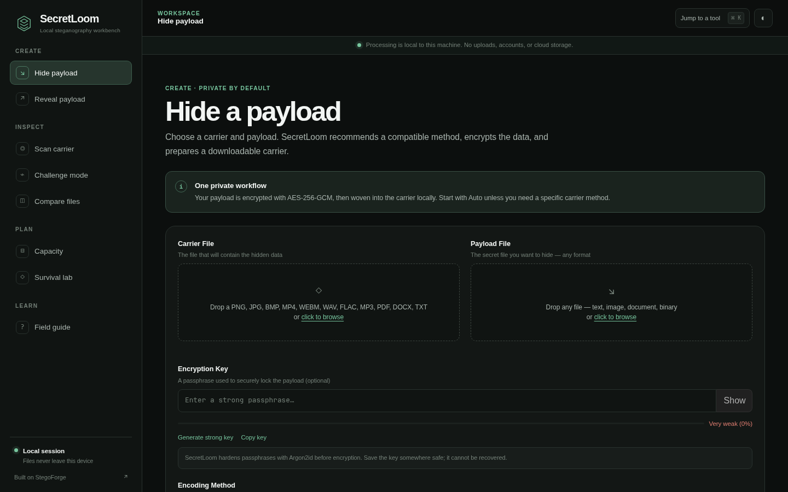

<div align="center">
  

  # SecretLoom

  **Weave data beneath the surface.**

  A private, local-first workbench for steganography, carrier analysis, and digital forensics.

  [](https://www.python.org/)
  [](LICENSE)
  [](#privacy-and-security)
</div>



SecretLoom is a redesigned and extended derivative of [Nour833/StegoForge](https://github.com/Nour833/StegoForge). It keeps the original engine, file format, detectors, and carrier support while providing a calmer interface, safer local server defaults, and clearer workflows. See [Attribution](#attribution) and [NOTICE.md](NOTICE.md) for provenance.

## What makes it different

- **A real workbench, not a wall of controls.** Tools are grouped into Create, Inspect, Plan, and Learn workflows with responsive two-column forms and progressive disclosure for advanced options.
- **Carrier-aware guidance.** Selecting a carrier highlights compatible techniques and recommends a sensible method while preserving complete manual control.
- **Private by default.** The workbench has no account, analytics, cloud storage, CDN fonts, or third-party browser assets.
- **Practical local helpers.** Generate and copy a strong key locally, jump between tools with `Ctrl/Cmd + K`, deep-link directly to a tool, and keep a light or dark theme preference on the device.
- **Hardened local service.** Upload names are sanitized, bit depth is validated, artifacts use opaque IDs, uploads are capped at 200 MB, and responses include a restrictive local security policy.
- **Backwards compatible.** Existing `.sfrg` payloads, the `stegoforge` Python module, the `.stegoforge` data directory, and the original `stegoforge` command remain supported.

## Quick start

SecretLoom requires Python 3.10 or newer. Video workflows also need FFmpeg.

```bash
git clone https://github.com/dlpwaters/secretloom.git
cd secretloom

python -m venv .venv
source .venv/bin/activate

pip install -r requirements.txt
pip install -r requirements-web.txt
pip install -e .

secretloom web
```

Open [http://127.0.0.1:5000](http://127.0.0.1:5000). The server binds to loopback only.

The legacy command is intentionally retained:

```bash
stegoforge web
```

## The workbench

| Workflow | Purpose |
| --- | --- |
| **Hide payload** | Encrypt and embed any payload into a compatible image, audio, video, document, or binary carrier. |
| **Reveal payload** | Extract a payload with automatic method detection, inline previews, and correct download types. |
| **Scan carrier** | Run selected statistical, metadata, ML, fingerprint, blind, and binary detectors. |
| **Challenge mode** | Run the complete forensic pipeline, rank results, export JSON, and recover extractable payloads. |
| **Compare files** | Compare clean and modified carriers and generate an amplified image heatmap. |
| **Capacity** | Estimate per-method capacity, utilization, depth tradeoffs, and stealth score before embedding. |
| **Survival lab** | Simulate platform processing and test whether a payload survives recompression or metadata stripping. |
| **Field guide** | Learn the formats, methods, security model, and CLI without leaving the app. |

## Carrier and method support

| Carrier family | Formats | Methods |
| --- | --- | --- |
| Images | PNG, JPEG, BMP, GIF, WebP | LSB, adaptive LSB, DCT, fingerprint-aware LSB, alpha, palette |
| Video | MP4, WebM | Keyframe DCT, motion-aware embedding |
| Audio | WAV, FLAC, MP3, OGG | Sample LSB, phase coding, spectrogram |
| Documents | TXT, PDF, DOCX, XLSX | Unicode whitespace, linguistic, PDF streams, Office XML |
| Binaries | ELF, PE, EXE, DLL | Slack, note, and overlay embedding |
| Network | TCP/IP and timing channels | CLI-only covert channel and dead-drop workflows |

Payload protection includes AES-256-GCM, Argon2id key derivation, decoy payloads, polymorphic traversal, Reed-Solomon wet-paper wrapping, and platform-aware survival profiles.

## CLI examples

```bash
# Let SecretLoom select a carrier-aware method
secretloom encode -c photo.png -p secret.pdf -k "correct horse battery staple"

# Reveal a payload
secretloom decode -f photo_stego.png -k "correct horse battery staple"

# Run the full forensic pipeline
secretloom ctf -f suspicious.mp3

# Check fit before embedding
secretloom capacity -c photo.png --depth 1

# Compare a clean carrier and its modified output
secretloom diff -c photo.png -s photo_stego.png --save-heatmap heatmap.png

# Launch the local workbench on another port
secretloom web --port 5050
```

Use `SECRETLOOM_KEY` to avoid placing a key in shell history. The original `STEGOFORGE_KEY` variable remains supported for existing automation, just like the `stegoforge` command alias.

## Privacy and security

The web interface and its static assets are served from the local process. Uploaded files are handled in temporary directories and are not sent to SecretLoom, the upstream project, or a third-party service. Generated download artifacts expire from the temporary directory cleanup cycle.

Some explicitly networked features are exceptions by design:

- the release updater contacts GitHub when you run `secretloom update`;
- dead-drop and covert network commands contact the destination you provide;
- a missing ML model may be resolved by the existing engine setup workflow when not bundled by a distribution.

SecretLoom is a research and forensics tool. Use it only with files, systems, and networks you are authorized to test. Encryption and steganography do not make unlawful activity lawful.

## Architecture

```text
SecretLoom
├── stegoforge.py        # CLI and stable compatibility module
├── core/
│   ├── image/           # LSB, adaptive, DCT, fingerprint, alpha, palette
│   ├── audio/           # sample LSB, phase, spectrogram
│   ├── video/           # DCT and motion-aware embedding
│   ├── document/        # Unicode, linguistic, PDF, Office XML
│   ├── binary/          # ELF and PE carriers
│   ├── crypto/          # AES-GCM, Argon2id, decoy, wet paper
│   └── network/         # TCP and timing channels
├── detect/              # statistical, ML, metadata, and blind analysis
├── protocol/            # dead drops and X25519 key exchange
└── web/                 # Flask API and SecretLoom workbench
```

The `SFRG` magic header and internal module names are retained intentionally so SecretLoom can read files produced by StegoForge and vice versa.

## Development

```bash
python -m venv .venv
source .venv/bin/activate
pip install -r requirements.txt -r requirements-web.txt pytest

pytest -q
python -m py_compile web/app.py stegoforge.py
node --check web/static/app.js
```

New carrier methods should implement the existing `BaseEncoder` contract and include focused pytest coverage. Interface changes should be checked at desktop and mobile widths.

## Attribution

SecretLoom is based on **StegoForge**, created by [Nour833](https://github.com/Nour833). The upstream project is available at [Nour833/StegoForge](https://github.com/Nour833/StegoForge) under the MIT License.

The original MIT copyright notice is preserved in [LICENSE](LICENSE). SecretLoom's interface, product identity, server hardening, documentation, and related modifications are maintained separately by the SecretLoom contributors. SecretLoom is not presented as the upstream project or an official upstream release.

## License

MIT. See [LICENSE](LICENSE) and [NOTICE.md](NOTICE.md).
